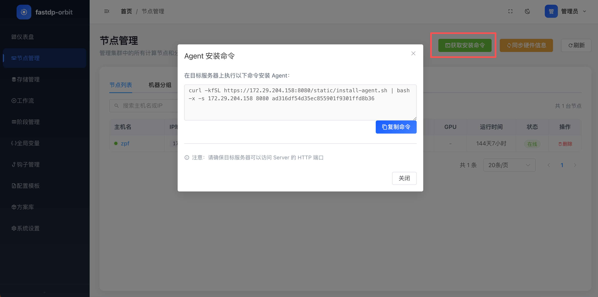
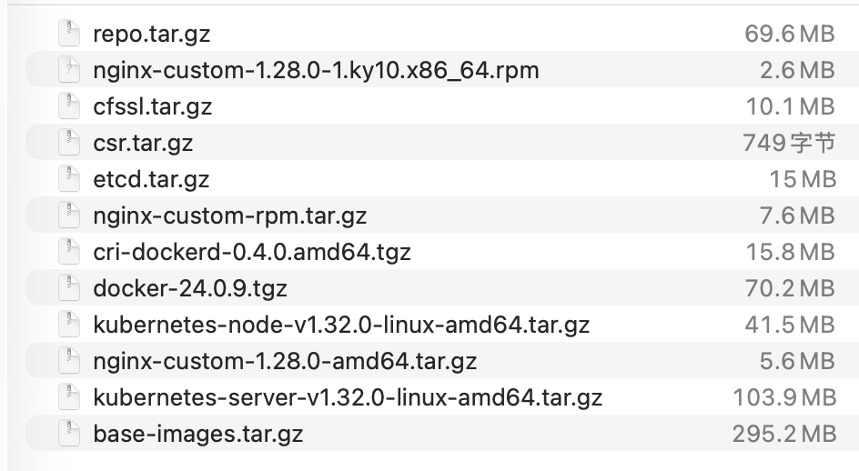
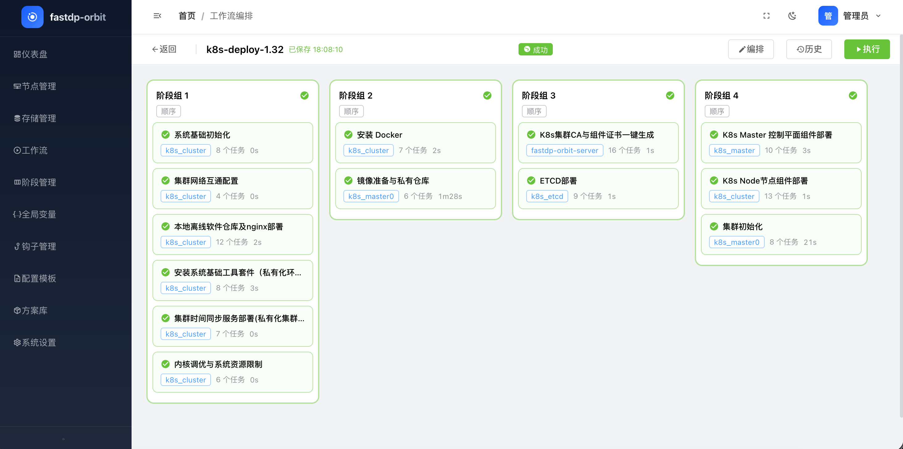

# FastDP Orbit

**多机可视化运维编排平台 —— 让批量运维像搭积木一样简单**

> 不同于 Ansible 的 YAML 手写、SSH 轮询模式，FastDP Orbit 通过 **可视化拖拽编排** + **gRPC 长连接 Agent** + **幂等声明式模块**，让多机批量运维变得直观、可靠、可追溯。

## 为什么选择 Orbit

| 对比维度 | Ansible / SaltStack | FastDP Orbit                    |
|---|---|---------------------------------|
| 编排方式 | YAML 手写 Playbook | **可视化拖拽画布**，所见即所得               |
| 机器通信 | SSH 轮询，无状态 | **gRPC 长连接**，实时心跳、毫秒级响应         |
| 学习曲线 | 需要掌握 YAML + Jinja2 | **Web UI 操作**，降低学习门槛            |
| 任务可观测 | 命令行日志 | **实时任务流**，逐机器执行状态可视化，执行记录可追溯    |
| K8s 部署 | 需要自行准备方案 | **内置离线部署方案库**（K8s v1.32 二进制 HA） |
| 多机扩展 | 受限于 SSH 并发 | **gRPC 连接池**，轻松管理数百台机器          |

## 架构

```
┌─────────────────────────────────────────────────┐
│                    Web UI (Vue 3)                │
│  工作流画布 / 机器管理 / 方案库 / 存储管理        │
└──────────────────────┬──────────────────────────┘
                       │ HTTP (JSON API)
┌──────────────────────▼──────────────────────────┐
│              Orbit Server (Go/Gin)               │
│  认证 / 工作流引擎 / 方案库 / 阶段模板 / 文件存储  │
│  SQLite (单机) / MySQL (集群)                    │
└──────┬────────────────────────────────┬──────────┘
       │ gRPC                            │ gRPC
┌──────▼──────┐                ┌─────────▼────────┐
│  Agent 1    │    ......      │    Agent N        │
│ (Go)        │                │ (Go)              │
│ 16 运维模块  │                │ 16 运维模块        │
└─────────────┘                └──────────────────┘
```

- **Server**: 中心控制节点，提供 HTTP API 和 gRPC 服务，管理机器、工作流、方案库
- **Agent**: 部署在目标机器上，通过 gRPC 长连接接收任务并执行 16 个运维模块
- **CLI** (`orbitctl`): 命令行工具，用于登录 Server、管理机器、获取 Agent 安装命令等

## 核心功能

| 功能 | 说明 |
|---|---|
| 可视化工作流编排 | 拖拽式构建运维流水线，支持多阶段并行执行、条件钩子、全局变量 |
| 批量机器管理 | Agent 自动注册、gRPC 心跳保活、硬件/OS/网络/GPU 信息采集 |
| 声明式模块 | 16 个 Agent 模块全部幂等设计，重复执行无副作用 |
| 方案库 (Solution Library) | 预置/自定义运维方案（含 K8s v1.32 离线部署），一键应用到机器集群 |
| 阶段模板 | 可复用的任务模板，支持版本管理和回滚 |
| 文件存储 | 分块上传、断点续传，支持 wget 直传下载 |
| CLI 管理 | `orbitctl` 全功能命令行：登录、机器管理、密码重置 |
| JWT 认证 | 登录鉴权、密码强度校验、首次登录强制改密、6h 令牌过期 |

## 快速开始

### 1.安装
#### 下载发行包
```bash
# amd64版本
wget https://gitee.com/zhao-pengfei2/fastdp-orbit/releases/download/v1.0.0/fastdp-orbit-linux-amd64-v1.0.0.tar.gz

# arm64版本
wget https://gitee.com/zhao-pengfei2/fastdp-orbit/releases/download/v1.0.0/fastdp-orbit-linux-arm64-v1.0.0.tar.gz
```
tar.gz包内容：
```
├── configs                             # 配置目录
│   ├── agent.toml                      # Agent 运行配置（Server 地址、gRPC 端口、日志等）
│   └── server.toml                     # Server 运行配置（HTTP/HTTPS、数据库、gRPC 等）
├── dist                                # 前端静态页面（Server 运行时自动加载）
├── install-agent.sh                    # Agent 一键安装脚本
├── install-server.sh                   # Server 一键安装脚本（参数：本机 IP）
├── k8s-deploy-1.32.yaml                # K8s v1.32 高可用集群部署方案
├── k8s-destroy-1.32.yaml               # K8s v1.32 集群销毁方案
├── orbit-agent                         # Agent 二进制（部署到目标机器）
├── orbit-agent.service                 # Agent systemd 服务单元
├── orbit-server                        # Server 二进制（中心控制节点）
├── orbit-server.service                # Server systemd 服务单元
└── orbitctl                            # 命令行工具（登录、机器管理等）
```
安装步骤:
```bash
#解压对应的发行版文件
tar -xvf fastdp-orbit-linux-amd64-v1.0.0.tar.gz

cd fastdp-orbit-linux-amd64

#启动server服务，x.x.x.x指定为监听本机的ipv4地址
bash install-server.sh x.x.x.x
```
安装脚本会自动启动 Server，默认监听 0.0.0.0:8080（HTTPS）。

- 首次运行自动创建 SQLite 数据库
- 初始用户：`admin / admin123`
- 默认使用自签证书，后续可替换为正规 CA 签发的证书

### 2.访问Web界面
浏览器打开 `https://<server-addr>:8080`，登录后即可使用。

### 3. 部署 Agent（通过 Web 页面或 CLI）
**方式一：Web 页面** —— 机器管理 → 安装 Agent，复制生成的命令到目标机器执行。



**方式二：CLI：**

```bash
#设置Server地址，如果已替换合规证书，则需要设置为证书所绑定的域名或ip
orbitctl config set-server <server-addr>:8080

# 登录
orbitctl login admin

#配置跳过TLS验证
orbitctl config set-tls-insecure true

# 获取 Agent 安装命令
orbitctl install

# 将获取到的命令在目标机器执行
```

### 4.导入预制方案部署高可用k8s

后续可根据需要自行编辑调整版本及部署流程

> 本方案支持ubuntu22.04版本和Kylin V10 SP3，部署测试通过
>
> 单机部署，多master高可用部署，节点扩容，均可通过该方案实现


导入后点击应用，并按照提示配置好机器分组

将以下依赖文件上传至存储管理中


工作流中选择 `k8s-deploy-1.32`，点击执行。全部完成后如下图所示，通常 5 分钟内即可完成部署。



## Agent 模块

在远程机器上执行的原子操作单元 —— 全部幂等设计（shell/script 为命令式模块，执行即运行，不保证幂等）

| 模块 | 功能 | 说明 |
|---|---|---|
| `shell` | Shell 命令 | 执行单条命令，返回 stdout/stderr/退出码 |
| `script` | 脚本执行 | 上传脚本并通过临时文件执行，支持 heredoc 和大体积脚本 |
| `file` | 文件/目录管理 | 创建、删除、修改权限/属主，类似 Ansible file 模块 |
| `copy` | 文件复制 | 从 Server 复制文件到远程机器，支持权限/属主设置 |
| `template` | 模板渲染 | Go template 语法，变量替换后写入目标文件 |
| `lineinfile` | 单行文本管理 | 按正则匹配行，替换/插入/删除 |
| `blockinfile` | 文本块管理 | 在标记块内插入/更新/删除内容 |
| `file_pull` | 文件下载 | 从 HTTP(S) URL 下载文件到远程机器 |
| `image` | Docker 镜像管理 | pull/push/load/rmi，带完整性校验 |
| `package` | 包管理器 | 多系统兼容（yum/apt/apk），install/remove/update |
| `repo` | 仓库管理 | yum repo / apt source 配置管理 |
| `systemd` | 服务管理 | enable/disable/start/stop/restart daemon-reload |
| `modprobe` | 内核模块 | 加载/卸载内核模块，带幂等性检查 |
| `selinux` | SELinux 管理 | 开关 SELinux、设置策略（适配 K8s 场景） |
| `cfssl` | 证书管理 | 通过 cfssl 工具生成 CA/证书/密钥 |
| `unarchive` | 文件解压 | tar.gz/zip 等格式自动识别，带重复解压检查 |

## 构建

### 前置要求

- Go ≥ 1.26.4
- Node.js ≥ 18
- 前端依赖: `cd frontend && npm install`

### 全量构建

```bash
make build
```

产物输出到 `releases/<version>/`，包含两个架构：

```
releases/v1.0.0/
├── linux-amd64/
│   ├── orbit-server    (Server)
│   ├── orbit-agent     (Agent)
│   ├── orbitctl        (CLI)
│   ├── dist/            (前端页面)
│   ├── configs/         (配置文件)
│   ├── install-*.sh     (安装脚本)
│   ├── *.service        (systemd 服务)
│   └── k8s-*.yaml       (K8s 部署方案)
└── linux-arm64/
    └── ...
```

## 目录结构

```
├── Makefile                 # 构建入口
├── deploy/                  # 部署源文件
│   ├── configs/             # 配置文件
│   ├── install-*.sh         # 安装脚本
│   ├── *.service            # systemd 服务单元
│   └── k8s-*.yaml           # K8s 部署方案
├── releases/                # 构建产物（按版本）
├── backend/
│   ├── agent/               # Agent 端代码
│   │   ├── grpc/            # gRPC 服务端
│   │   ├── handler/         # Agent RPC 处理器
│   │   └── modules/         # 16 个任务模块
│   ├── api/                 # HTTP API
│   │   ├── middleware/      # JWT 认证、CORS
│   │   ├── views/           # 接口处理器
│   │   └── router.go        # 路由定义
│   ├── cli/                 # CLI 命令行工具
│   │   ├── commands/        # 子命令实现
│   │   └── cliutil/         # HTTP 客户端等工具
│   ├── config/              # 配置加载
│   ├── database/            # 数据库初始化与迁移
│   ├── engine/              # 工作流执行引擎
│   ├── models/              # 数据模型
│   ├── pkg/                 # 通用工具
│   ├── proto/               # Protobuf 定义
│   ├── server/              # 服务端组件（缓存、gRPC 池等）
│   └── services/            # 业务逻辑层
├── frontend/
│   ├── src/                 # Vue 3 源码
│   │   ├── pages/           # 页面组件
│   │   ├── components/      # 通用组件
│   │   ├── stores/          # Pinia 状态管理
│   │   ├── api/             # API 调用
│   │   ├── router/          # 路由
│   │   └── utils/           # 工具函数
│   └── package.json
└── proto/                   # Protobuf 源文件
```

## 技术栈

| 层 | 技术 |
|---|---|
| 后端 | Go 1.26, Gin, GORM, Viper, Cobra |
| 前端 | Vue 3, TypeScript, Element Plus, Pinia, Vite |
| 通信 | HTTP (REST API) + gRPC (Agent 长连接) |
| 认证 | JWT (6h 过期) |
| 数据库 | SQLite (默认) / MySQL (可选) |
| 协议 | Protobuf (Agent/Server 通信) |
| 构建 | Makefile, CGO_ENABLED=0 静态编译 |

## 参与反馈

本项目为个人开发，难免存在体验问题。欢迎通过以下方式参与：
- 🐛 [提交 Issue](https://gitee.com/zhao-pengfei2/fastdp-orbit/issues) —— 问题反馈、功能建议

如果这个项目对你有帮助，欢迎 Star ⭐ 支持一下，感谢！

## License

Apache-2.0
